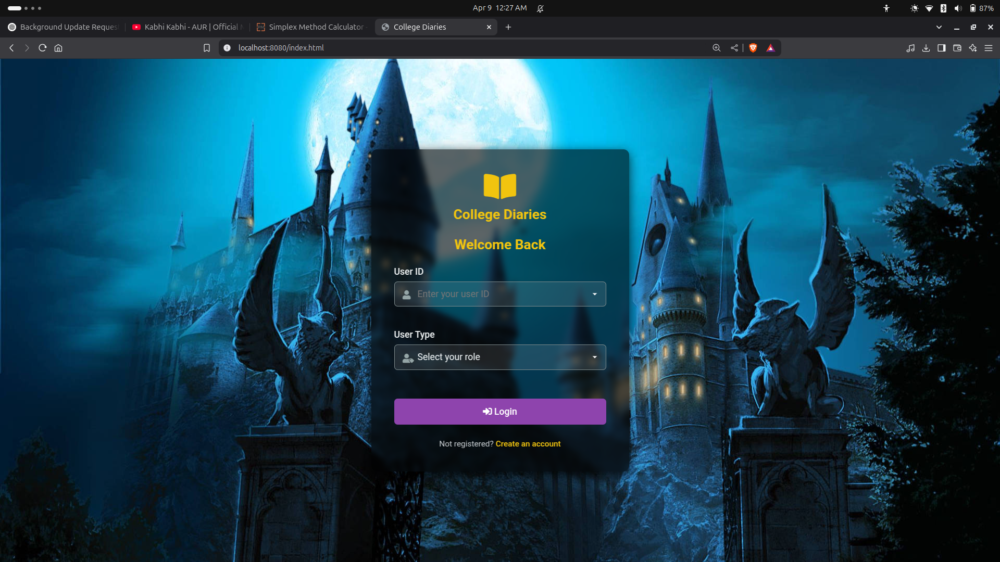
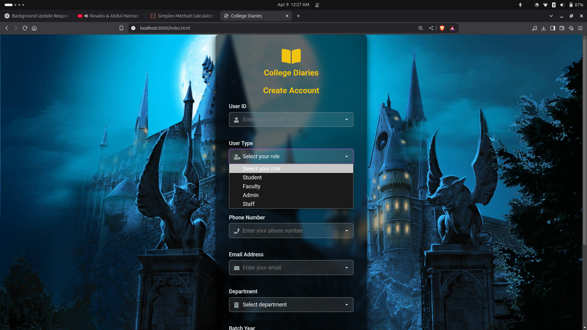
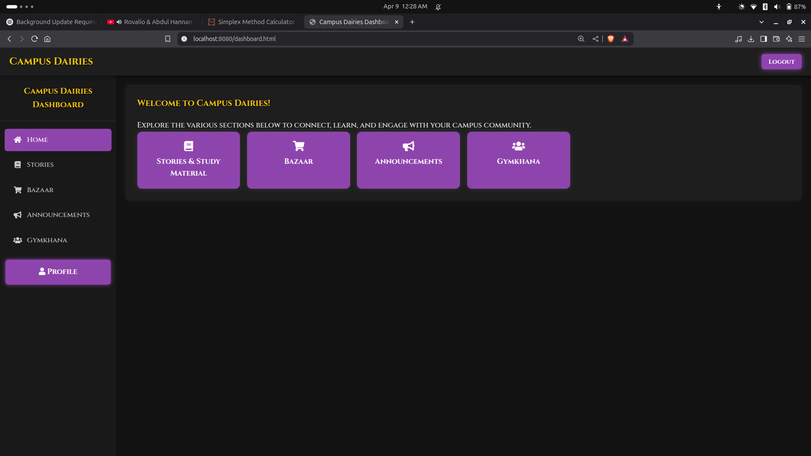
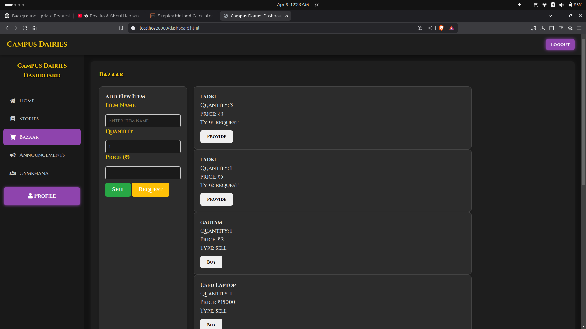
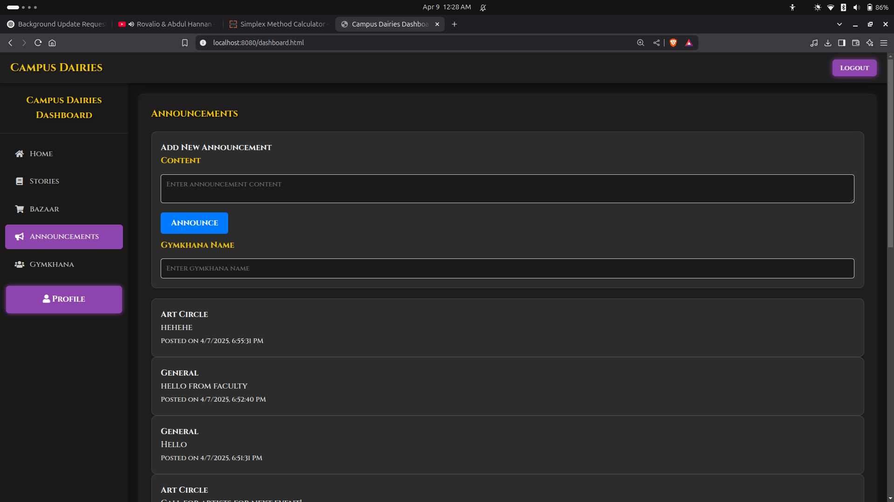
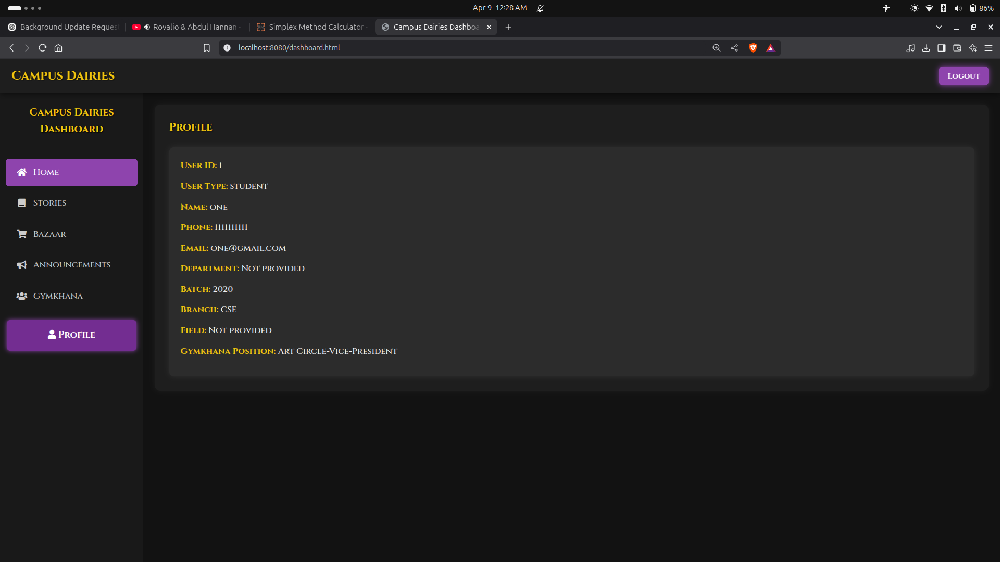
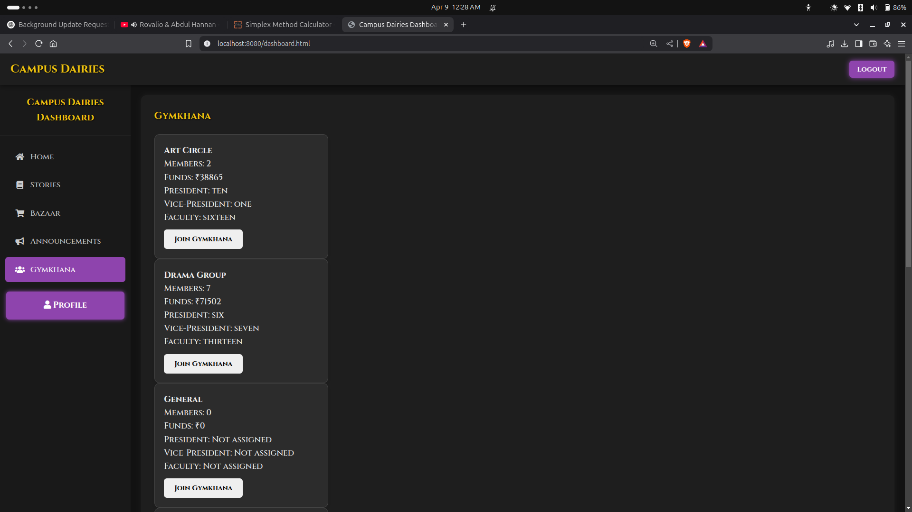
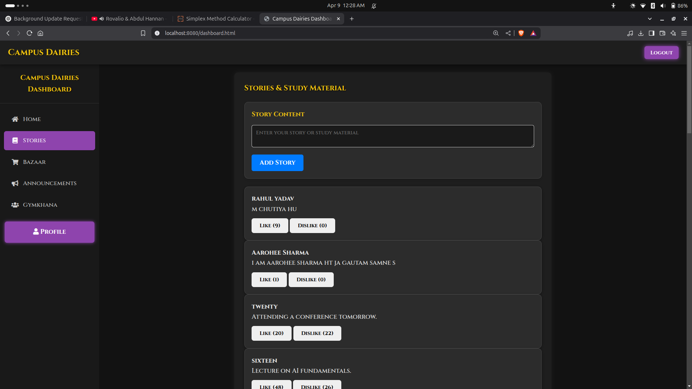

# 🎓 College Diaries

A web-based platform designed to help college students store, access, and contribute academic resources such as notes and previous year question papers (PYQs). Built using Java (with Maven), MySQL, HTML, CSS, and JavaScript.

## ✨ Features

- 📁 Upload and access subject-wise notes and PYQs
- 💬 Discussion section for academic queries
- 🔐 Restricted login using college email IDs
- 🧾 MySQL database integration for data storage
- ⚙️ Spring Boot backend with RESTful APIs

## 📦 Tech Stack

- **Backend**: Java, Spring Boot, JDBC, Maven
- **Frontend**: HTML, CSS, JavaScript
- **Database**: MySQL
- **Build Tool**: Maven

## 📂 Project Structure

```
college-diaries/
│
├── src/                       # Source files (controllers, servlets, etc.)
│
├── resources/
│   └── application.properties # DB connection settings
│
├── sqlschema.txt              # SQL schema for database setup
│
├── target/                    # Compiled files after build
│
└── pom.xml                    # Maven configuration
```
## 🖼️ Screenshots

### 🔐 Login Page


### 📝 Signup Page


### 🏠 Home Page


### 🛍️ Bazar Section


### 📢 Announcement Section


### 👤 Profile Section


### 🏛️ Gymkhana Section


### 📚 Story Section



## 🛠️ Setup Instructions

### Prerequisites

- Java JDK (17 or above recommended)
- Maven
- MySQL
- Git

### Step-by-Step Guide

1. **Clone the Repository**

   ```bash
   git clone https://github.com/G0dZilLAaA/college-dieries.git
   cd college-dieries
   ```

2. **Set Up the MySQL Database**

   - Open `sqlschema.txt`
   - Execute the SQL commands in your MySQL workbench or terminal to create the required database and tables.

3. **Update Configuration**

   Edit the `application.properties` file under `resources/` and provide your DB details:

   ```
   spring.datasource.url=jdbc:mysql://localhost:3306/your_db_name
   spring.datasource.username=your_username
   spring.datasource.password=your_password
   ```

4. **Build the Project**

   ```bash
   mvn clean install
   ```

5. **Run the Application**

   ```bash
   java -jar target/college-diaries-1.0-SNAPSHOT.jar
   ```

6. **Open in Browser**

   Visit: [http://localhost:8080/](http://localhost:8080/)

## 🔐 Login Info

The login system currently restricts access to college email IDs (e.g., ending with `@iiitg.ac.in`). You may modify this logic in the backend for broader testing.

## 🎯 Future Improvements

- ✅ Add search and filter options
- ✅ Enable comment voting system
- ✅ Add admin panel for resource moderation
- ✅ Implement file type and size restrictions
- ✅ Mobile responsive UI

## 🤝 Contribution

Pull requests are welcome! For major changes, please open an issue first to discuss your proposed changes.

## 📜 License

This project is open-source and available under the [MIT License](LICENSE).

---

Made with ❤️ by Mohit Kumawat (https://github.com/G0dZilLAaA)
